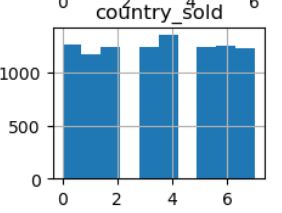
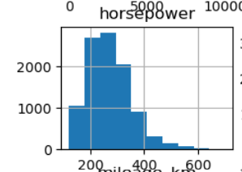
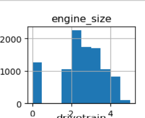
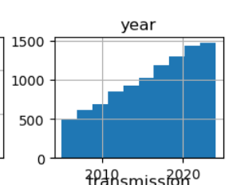
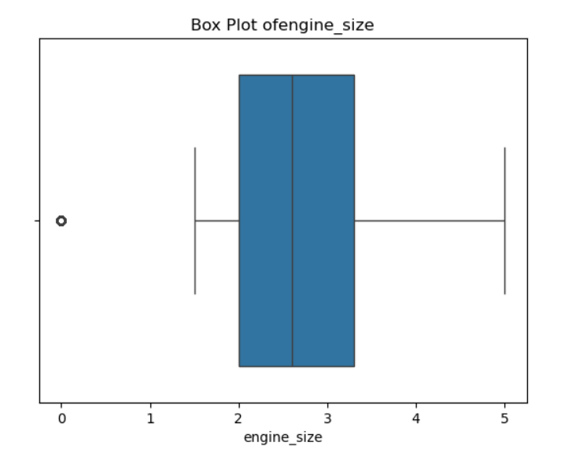
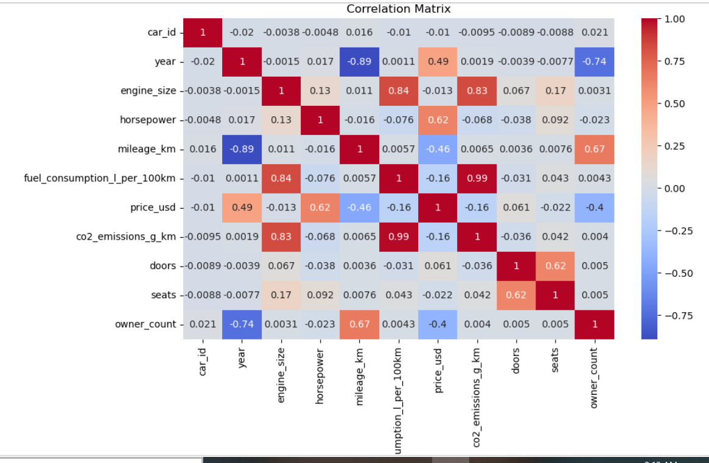
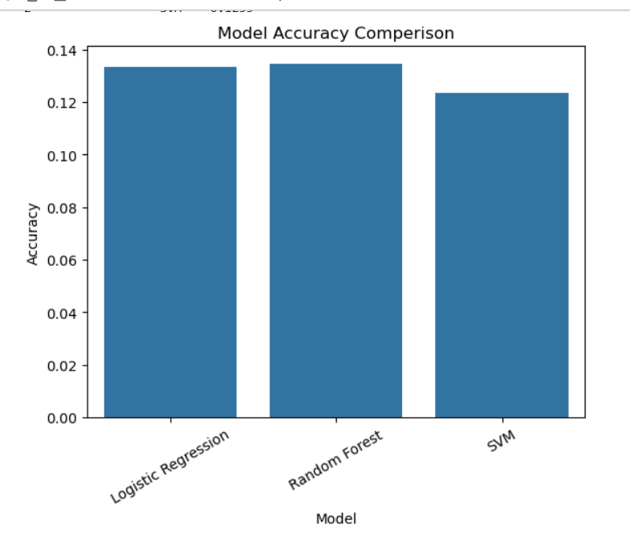

#  BMW Country Classification using Machine Learning

A machine learning classification project that predicts the **country where a BMW vehicle was sold** using multiple supervised learning algorithms implemented with **Scikit-learn**.

---

##  Project Overview

This project demonstrates an end-to-end machine learning workflow using a synthetic BMW dataset. The objective is to classify the `country_sold` variable based on various vehicle characteristics.

The project covers every major stage of a machine learning pipeline, from data preprocessing to model evaluation.

---

##  Objectives

* Explore and understand the BMW dataset.
* Perform data preprocessing and feature encoding.
* Train multiple classification models.
* Evaluate model performance.
* Compare the accuracy of different machine learning algorithms.

---

##  Dataset

The project uses a **synthetic BMW dataset** containing vehicle information such as:

* Model
* Year
* Engine Size
* Horsepower
* Fuel Type
* Transmission
* Drivetrain
* Mileage
* Fuel Consumption
* Price
* CO₂ Emissions
* Doors
* Seats
* Body Type
* Color
* Owner Count
* Accident History
* Service History

**Target Variable**

* `country_sold`

---

## 🛠 Technologies Used

* Python
* Pandas
* NumPy
* Matplotlib
* Seaborn
* Scikit-learn
* Jupyter Notebook

---

##  Machine Learning Workflow

1. Import libraries
2. Load dataset
3. Exploratory Data Analysis (EDA)
4. Data preprocessing
5. Encode categorical features
6. Split data into training and testing sets
7. Train machine learning models
8. Evaluate models
9. Compare model performance

---

##  Models Used

* Logistic Regression
* Random Forest Classifier
* Support Vector Machine (SVM)

---

##  Results

| Model                  |   Accuracy |
| ---------------------- | ---------: |
| Logistic Regression    | **13.35%** |
| Random Forest          | **12.65%** |
| Support Vector Machine | **12.35%** |

---

##  Key Findings

* Logistic Regression achieved the highest accuracy among the evaluated models.
* The dataset is synthetic; therefore, the target variable does not appear to have strong predictive relationships with the available features.
* Model performance is close to random guessing, highlighting the limitations of the synthetic data rather than errors in the machine learning pipeline.

---

##  Future Improvements

* Perform hyperparameter tuning.
* Apply cross-validation.
* Engineer additional features.
* Experiment with advanced models such as XGBoost or CatBoost.
* Deploy the model using Streamlit.

---

## 📁 Repository Structure

```text
bmw-country-classification-ml/
│
├── BMW Dataset.ipynb
├── README.md
├── requirements.txt
└── images/
```

---

## ▶️ How to Run

1. Clone the repository.
2. Install the required Python libraries.
3. Open the notebook in Jupyter Notebook or JupyterLab.
4. Run all cells from top to bottom.

---

## 👩‍💻 Author

**Tehreem Fatima**

BS Mathematics Student

Aspiring Data Scientist passionate about Machine Learning, Data Analysis, and Artificial Intelligence.

---

## ⭐ Acknowledgements

This project was created for learning, portfolio development, and practicing machine learning workflows using a synthetic dataset.
## Visualizations

### Country Sold Histogram


### Horsepower Histogram


### Engine Size Histogram


### Year Histogram


### Horsepower Box Plot


### Engine Size Box Plot


### Correlation Matrix


### Model Accuracy Comparison

